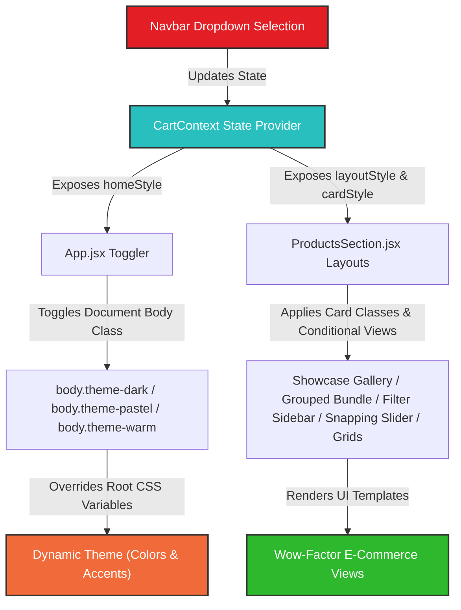

# 🍦 Jumys Ice Cream Web App 🍨

<p align="center">
  
  
  
  
  
</p>

```
    .-""-.
   /      \
  |  🌟    |    JUMYS PREMIUM ICE CREAM
   \      /     "Crafted with Code, Served with Love"
    `-..-`
     \  /
      \/
```

Welcome to the **Jumys Ice Cream** web application – a premium, state-of-the-art e-commerce storefront featuring interactive sandboxes, visual design layout engines, and dynamic visual themes.

Designed with **wow-factor aesthetics**, fluid micro-animations, glassmorphism elements, and fully responsive media layouts, this storefront offers a premium, high-fidelity mock-up experience matching high-end Shopify and custom headless e-commerce store qualities.

---

## 🎨 System Architecture Flow

Here is how the dynamic style and theme switching engine propagates selections from the Navbar down to render templates on the page:



---

## 🚀 Key Premium Features

### 1. 🏡 8 Dynamic Home Page Themes & Section Layouts
Switch between 8 pre-designed homepage variants dynamically from the **Home** navigation dropdown:
- **Home 1**: Standard showcase layout.
- **Home 2**: Soft Pastel theme (toggles `.theme-pastel` light teal visuals).
- **Home 3**: Dark Chocolate Luxury theme (toggles a gorgeous dark mode `.theme-dark`).
- **Home 4**: Flavors-first section order (places the flavor card grid at the top).
- **Home 5**: Minimalist view (collapses unnecessary informational blocks).
- **Home 6**: Warm Sunset Peach theme (toggles `.theme-warm` warm solar highlights).
- **Home 7**: Products-first section order.
- **Home 8**: Blog-first section order.

### 2. 🎛️ 13 Interactive Product Card Hover Styles
Explore a dynamic interactive sandbox built right into the Products Section. Select between different design styles to see how product cards dynamically transform:
- **Scale hover** & **Zoom hover** (premium zoom actions).
- **Slider hover** (slides secondary preview image).
- **Fadein hover** & **Icons on hover** (reveal actions on hover).
- **Icon & Add to cart** & **Standard bottom strip** styles.
- **Quick view button** & **Quick shop sizes panel**.
- **Wishlist on the bottom** & **Dual action buttons**.
- **Info in hover** & **New custom badges**.

### 3. 📐 16 Premium Product Listing Layouts
Click layout configurations under the **Product** navigation dropdown to instantly rearrange the listing section:
- **Grid Layouts**: 1 column, 2 columns, 4/5 columns, and a custom staggered masonry layout (`grid-modern`).
- **Sticky Banner Layout**: Split-screen displaying a sticky side advertisement card alongside listings.
- **Full Width Snapping Slider**: Horizontal track with swipe snaps and scrollbars.
- **Sidebar Filters**: Left and Right sidebars containing Categories, Range Price Sliders, and Size tags.
- **Detail Showcase Gallery**: Full product detail sheet mocks placing thumbnails left, right, bottom, or none.
- **Grouped Bundle Layout**: Combined bundle packages containing multiple signature flavors with single-click additions and combined price savings.
- **Tab & Info Structures**: Information details styled as horizontal tab headers, collapsible accordion drawers, and full-width specs sheets.

---

## 🍦 Under The Hood: The Secret Recipe

To guarantee the layout matches professional themes:
- **Flexbox Spacing Fix**: Badges (`NEW`/`HOT`) are positioned inline using `flexbox` layout with an `8px` gap, rather than absolute coordinate shifts, ensuring perfect vertical alignment without overlapping text on wrap.
- **Pure CSS Transitions**: Interactive cards use high-end cubic-bezier curves (`cubic-bezier(0.2, 0.8, 0.2, 1)`) for premium image scaling and slide-up animations.
- **CSS Variables Mapping**: The custom styling system switches colors smoothly by redefining layout variables on `.theme-dark`, `.theme-pastel`, and `.theme-warm`.

---

## 📦 Getting Started

### Prerequisites
Make sure you have Node.js and npm installed.

### Installation
1. Clone the repository or open the project folder.
2. Install dependencies:
   ```bash
   npm install
   ```

### Running Locally
To launch the hot-reloading development server:
   ```bash
   npm run dev
   ```

### Production Build
To build and bundle the project for production distribution:
   ```bash
   npm run build
   ```

---

## 🤝 Connect & Socials

Let's build something delicious together! Check out my developer channels below:

<p align="left">
  <a href="https://github.com" target="_blank">
    
  </a>
  <a href="https://linkedin.com" target="_blank">
    
  </a>
  <a href="https://twitter.com" target="_blank">
    
  </a>
  <a href="https://instagram.com" target="_blank">
    
  </a>
  <a href="mailto:contact@jumyicecream.com">
    
  </a>
</p>
